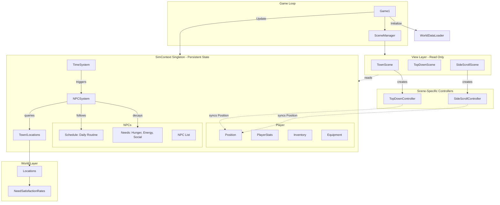
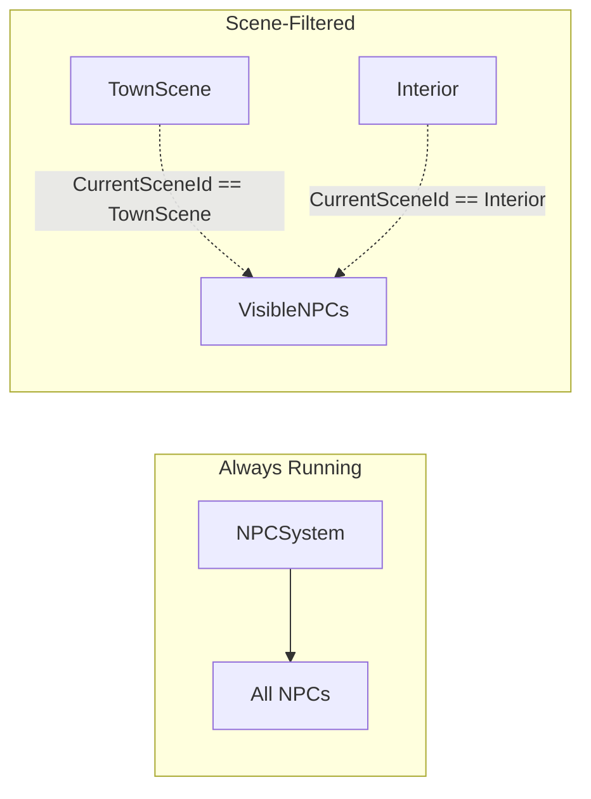

# Architecture

## Overview
This project is a 2D Town Simulation and Jump & Run game built with **MonoGame** and **.NET 8**. The architecture is designed to decouple **Simulation Data** from **Rendering/View Logic**, allowing for a system-driven gameplay experience where NPCs live freely in a semantic world.

## High-Level Architecture

The application is structured into distinct layers:

1.  **Core**: Manages the application lifecycle, global state (Time, SimContext), Scene transitions, and World initialization.
2.  **World**: Defines the semantic environment (Town, Locations) without concern for pixels.
3.  **Simulation**: Handles the logic for Player, NPCs, including Needs, Schedules, and AI.
4.  **Scenes**: Connects the Core, World, and Simulation layers to the MonoGame Rendering loop (view-only).



## Directory Structure

```text
JumpAndRun/
├── Core/           # System-level infrastructure
│   ├── SimContext.cs # SINGLETON - Container for global simulation state
│   ├── TimeSystem.cs # Handles Day/Hour/Minute progression and events
│   ├── WorldDataLoader.cs # Initializes world data (Locations, NPCs) at game start
│   ├── WorldData.cs  # DTOs for JSON deserialization
│   ├── Scene.cs    # Abstract base class for game states (has SceneId property)
│   ├── SceneManager.cs # Handles switching between Scenes, tracks ActiveSceneId
│   └── SceneFactory.cs # Creates scenes by ID for portal transitions
├── World/          # Semantic world data
│   ├── Town.cs     # Collection of Locations
│   └── Location.cs # Definition of places (has SceneId, TargetSceneId for portals)
├── Simulation/     # Agent logic and data
│   ├── Player.cs   # Player data (Stats, Inventory, Equipment) - PERSISTENT
│   ├── PlayerStats.cs # RPG-like statistics (Level, Health, Strength, etc.)
│   ├── Inventory.cs # Item storage and management
│   ├── Equipment.cs # Equipped items and stat bonuses
│   ├── NPC.cs      # Core entity data (Name, Pos, State, CurrentSceneId)
│   ├── NPCSystem.cs # Logic loop for updating NPCs (cross-scene movement)
│   ├── Needs.cs    # Hunger, Energy, etc.
│   ├── Schedule.cs # Daily routine definitions
│   └── Background.cs # Static character traits
├── Scenes/         # Concrete game states (View Layer - READ ONLY from simulation)
│   ├── TownScene.cs # Main town view (filters NPCs by SceneId)
│   ├── TopDownScene.cs # Legacy/Alternative gameplay mode
│   ├── SideScrollScene.cs # Side-scrolling gameplay mode
│   └── BakerHouseInteriorScene.cs # Example building interior
├── Entities/       # Shared game objects (ECS-lite)
└── Components/     # Reusable logic blocks (Collider, SpriteRenderer, Controllers)
    ├── TopDownController.cs # Syncs position with Player data
    └── SideScrollController.cs # Syncs position with Player data
```

## Key Systems

### 1. SimContext (Singleton)
*   **Location**: `Core/SimContext.cs`
*   **Pattern**: Singleton - persists across scene changes
*   **Contains**: Player, TimeSystem, Town, NPCs list, NPCSystem
*   **Update**: Called by `Game1.Update()` to tick all simulation systems

### 2. Player System
*   **Location**: `Simulation/Player.cs`, `PlayerStats.cs`, `Inventory.cs`, `Equipment.cs`
*   **Pattern**: Model-View separation (data persists, views are scene-specific)
*   **Data Flow**: 
    *   Controllers read position from `Player` on `Start()`
    *   Controllers write position back to `Player` on `Update()`
    *   Different scenes create different visual representations (TopDown vs SideScroll)

### 3. WorldDataLoader
*   **Location**: `Core/WorldDataLoader.cs`
*   **Function**: Initializes world data (Locations, NPCs, Schedules) at game start
*   **Data Sources**: Loads from `Content/Data/locations.json` and `Content/Data/npcs.json`
*   **Fallback**: Uses hardcoded defaults if JSON files are missing
*   **Called**: Once in `Game1.Initialize()` before loading any scene

### 4. Time System
*   **Location**: `Core/TimeSystem.cs`
*   **Function**: Tracks simulation time (Day, Hour, Minute).
*   **Scaling**: Decoupled from real-time (e.g., 1 real second = 1 game minute).
*   **Events**: Triggers callbacks (`OnHourChanged`, etc.) for systems to react to.

### 5. NPC Simulation Loop
*   **Location**: `Simulation/NPCSystem.cs`
*   **Logic**:
    1.  **Decay**: Needs (Hunger, Energy) decrease over time.
    2.  **Recovery**: If at a providing Location, Needs increase based on `Location.NeedSatisfactionRates`.
    3.  **Critical Needs**: If Needs drop below 20%, NPC seeks the best Location (e.g., Home for Sleep).
    4.  **Hysteresis**: NPC stays at the recovery location until the need is fully satisfied (>95%).
    5.  **Schedule**: Otherwise, follows the daily routine.

### 6. Scene Management
*   **Location**: `Core/SceneManager.cs`
*   **Pattern**: State Pattern.
*   **Usage**: The `Game1` class forwards `Update` and `Draw` calls to the active `Scene`. 
*   **SimContext**: Passed to scenes via base constructor. Scenes READ from SimContext, don't own it.
*   **Persistence**: Player, NPCs, and world state persist across scene transitions.
*   **Scene Identification**: Each scene has a unique `SceneId` property. `SceneManager.ActiveSceneId` tracks the current scene.

### 7. World Representation
*   **Location**: `World/`
*   **Concept**: Locations are logical entities that act as **Need Providers**.
*   **Scene Ownership**: Each Location has a `SceneId` indicating which scene it belongs to.
```csharp
class Location {
    string SceneId;  // e.g., "TownScene", "HouseInteriorScene"
    Vector2 EntryPosition;  // Spawn point when entering via portal
    Dictionary<NeedType, float> NeedSatisfactionRates;
}
class Town {
    Location GetBestLocationForNeed(NeedType need);
}
```

### 8. Hybrid Scene + Portal Architecture
*   **Core Principle**: NPCs are **always simulated** regardless of active scene. Scenes only **filter rendering**.
*   **NPC Scene Tracking**: `NPC.CurrentSceneId` tracks which scene the NPC is visually in.
*   **Position Preservation**: `NPC.ScenePositions` dictionary preserves position per-scene.
*   **Cross-Scene Movement**: When `NPCSystem.MoveTo()` targets a location in a different scene, the NPC transitions:
    1. Save current position to `ScenePositions`
    2. Update `CurrentSceneId` to target scene
    3. Load position from `ScenePositions` or use `Location.EntryPosition`

### 9. Building/Portal Model
*   **Enterable Buildings**: Any `Location` with `TargetSceneId` set becomes a portal to another scene.
*   **Non-Enterable Locations**: Locations without `TargetSceneId` remain in the current scene.
*   **Scene Factory**: `SceneFactory.Create(sceneId)` instantiates scenes by ID for portal transitions.
*   **JSON Configuration**:
```json
// Enterable building (house)
{
  "id": "home_01",
  "name": "Baker's Home",
  "sceneId": "TownScene",
  "targetSceneId": "BakerHouseInterior"
}

// Non-enterable location (market)
{
  "id": "market_01",
  "name": "Market",
  "sceneId": "TownScene"
  // No targetSceneId = not a portal
}
```



## Data Flow

### Initialization
*   `Game1.Initialize()` -> `WorldDataLoader.Initialize(SimContext.Instance)`
*   World data (Locations, NPCs, Player) created once and stored in SimContext singleton

### Update Loop
*   `Game1` -> `SimContext.Instance.Update()` (Time + NPCSystem)
*   `Game1` -> `SceneManager` -> `ActiveScene.Update()` (Player input, Camera)
*   Simulation runs regardless of which scene is active

### Draw Loop
*   `Game1` -> `SceneManager` -> `ActiveScene.Draw()`
*   Scene reads `Context.Player`, `Context.NPCs`, and `Context.Town` to render
*   **NPC Filtering**: `Context.NPCs.Where(n => n.CurrentSceneId == SceneId)`

### Scene Transition
```
┌─────────────────────────────────────────────────────────────┐
│ 1. Old Scene unloads → Controller syncs Position to Player  │
│ 2. New Scene loads → Controller reads Position from Player  │
│ 3. Player.Stats, Inventory, NPCs unchanged (never destroyed)│
└─────────────────────────────────────────────────────────────┘
```

## Future Considerations

| Feature | Notes |
|---------|-------|
| Equipment Effects | Stats modifiers from equipped items |
| Save/Load | Serialize Player + SimContext to disk |
| Different Sprites | TopDown vs SideScroll sprite sheets per scene |
| Window Peeking | Draw simplified NPC sprites in building windows |
| Interior NPCs | Render NPCs in building interiors when player enters |


